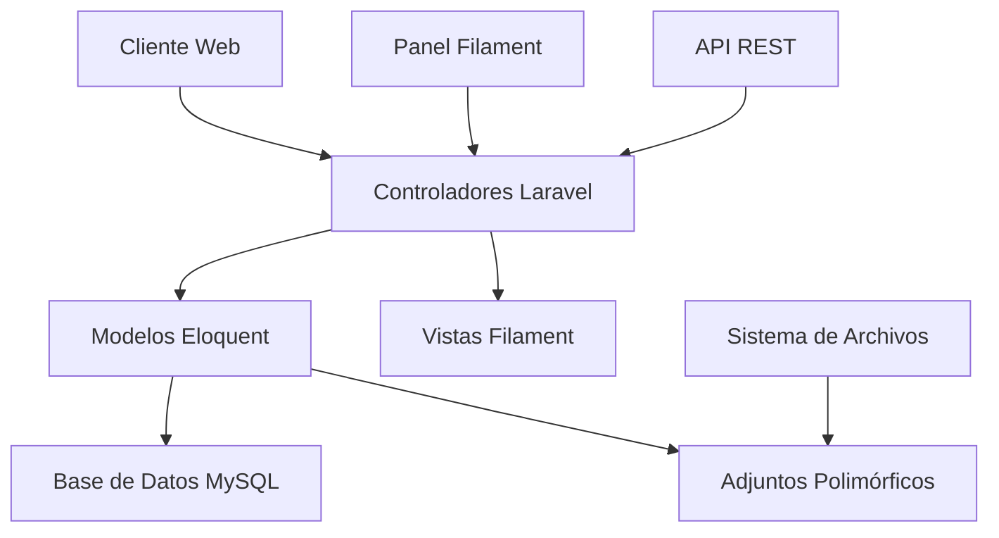
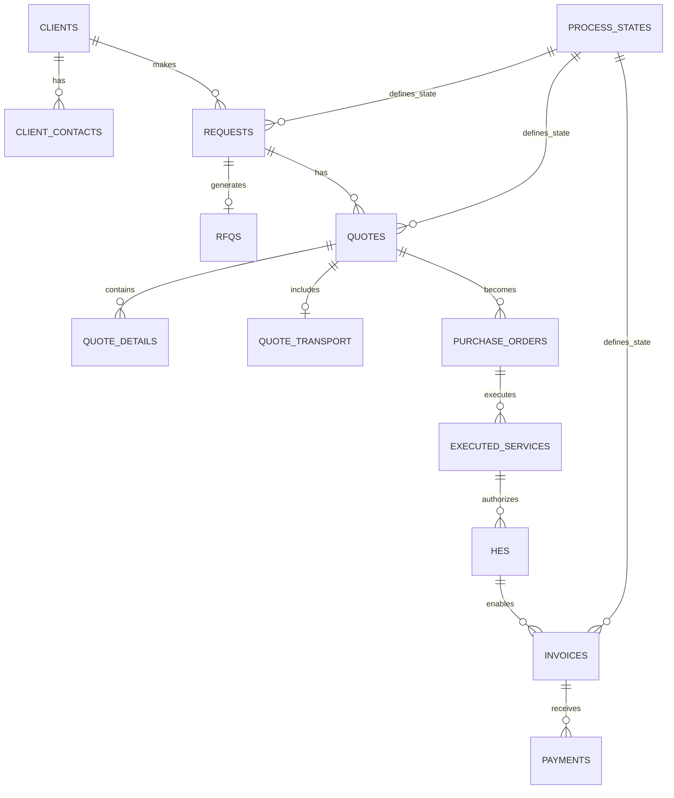

# Sistema de Seguimiento de Documentos - Análisis del Sistema

## Visión General

El **Sistema de Seguimiento de Documentos** es una aplicación web empresarial desarrollada en **Laravel 12** que gestiona el ciclo completo de servicios técnicos, desde la solicitud inicial hasta el pago final. El sistema centraliza la documentación y seguimiento de procesos de negocio críticos para empresas de servicios técnicos que trabajan con clientes corporativos (clínicas, hospitales, empresas).

### Propósito del Sistema
- **Gestión centralizada** de documentos y procesos de servicio
- **Seguimiento completo** del flujo de trabajo desde solicitud hasta pago
- **Control de estados** configurable para cada etapa del proceso
- **Auditoría completa** de todas las operaciones
- **Gestión de adjuntos** polimórfica para evidencias y documentos oficiales

## Stack Tecnológico

### Backend Framework
- **Laravel 12** - Framework PHP moderno
- **PHP 8.2+** - Lenguaje de programación
- **MySQL** - Base de datos relacional
- **Filament 4** - Panel de administración moderno

### Entorno de Desarrollo
- **Windows** - Sistema operativo de desarrollo
- **Composer** - Gestión de dependencias PHP
- **Artisan** - CLI de Laravel para migraciones y comandos

## Arquitectura del Sistema

### Patrón Arquitectónico
El sistema sigue una **arquitectura monolítica** basada en el patrón **MVC (Modelo-Vista-Controlador)** de Laravel:



### Componentes Principales

#### 1. Capa de Presentación
- **Filament 4** para interfaz administrativa
- **Blade Templates** para vistas personalizadas
- **Componentes reactivos** para gestión de estados

#### 2. Capa de Lógica de Negocio
- **Controladores** para manejo de peticiones
- **Modelos Eloquent** con relaciones complejas
- **Middleware** para autorización y auditoría

#### 3. Capa de Datos
- **MySQL** como motor de base de datos
- **Migraciones Laravel** para versionado de esquema
- **Seeders** para datos iniciales

## Diseño de Base de Datos

### Estructura de Entidades Principales



### Flujo de Proceso de Negocio

El sistema gestiona un flujo secuencial crítico:

1. **SOLICITUD** → Punto de entrada del proceso
2. **RFQ** → Documento formal opcional del cliente
3. **COTIZACIÓN** → Generación automática con versionado
4. **ORDEN DE COMPRA** → Autorización del cliente
5. **SERVICIO EJECUTADO** → Realización del trabajo
6. **HES** → **CRÍTICO** - Hoja de Entrada de Servicio (obligatoria para facturar)
7. **FACTURA** → Documento contable
8. **PAGO** → Conciliación financiera

### Entidades Críticas del Sistema

#### Tabla `clients` (Clientes)
**Propósito**: Gestión maestra de clientes corporativos
- Tipos: clínicas, hospitales, empresas privadas, instituciones públicas
- Información fiscal completa (RUC, dirección fiscal)
- Gestión de contactos múltiples por cliente

#### Tabla `requests` (Solicitudes)
**Propósito**: Punto de entrada único para todos los servicios
- Numeración automática única
- Múltiples orígenes: WhatsApp, email, teléfono, presencial
- Clasificación por urgencia y departamento solicitante

#### Tabla `quotes` (Cotizaciones)
**Propósito**: Generación y versionado de cotizaciones
- **Sistema de versionado** mediante `parent_quote_id`
- Cálculo automático de impuestos (18% por defecto)
- Soporte multi-moneda (PEN/USD)
- Templates configurables para generación

#### Tabla `hes` (Hojas de Entrada de Servicio)
**CRÍTICO**: Esta tabla es **OBLIGATORIA** para facturación
- `invoices.hes_id` es **NOT NULL** - sin HES no hay factura
- Contiene autorización formal del cliente
- Define método de pago y términos comerciales
- Registro de descuentos para factoring

#### Tabla `process_states` (Estados de Proceso)
**Propósito**: Sistema de estados configurable por entidad
- Estados específicos por tipo de documento
- Configuración de colores y orden de visualización
- Definición de estados iniciales y finales

### Características Técnicas Avanzadas

#### Sistema de Adjuntos Polimórfico
```php
// Relación polimórfica - cualquier entidad puede tener adjuntos
attachable_type: "App\Models\Request"
attachable_id: 123
category: "evidence" | "official" | "backup" | "generated"
```

#### Auditoría Completa
- **Tabla `audit_log`**: Registro automático de todos los cambios
- Captura valores anteriores y nuevos en formato JSON
- Tracking de usuario, IP y user agent
- Soporte para INSERT, UPDATE, DELETE

#### Eliminación Suave (Soft Deletes)
- Preservación de datos históricos críticos
- Columna `deleted_at` en tablas principales
- Recuperación de registros eliminados accidentalmente

### Reglas de Negocio Implementadas

#### 1. Versionado de Cotizaciones
```sql
-- Estructura para versiones
parent_quote_id: NULL (versión original)
parent_quote_id: 123, version: 2 (segunda versión)
```

#### 2. Validación de Integridad
- Los números de PO en HES deben coincidir con la OC original
- Las fechas de servicio deben ser coherentes en todo el flujo
- Los montos autorizados no pueden exceder los cotizados

#### 3. Control de Estados
- Estados configurables por entidad
- Validación de transiciones de estado
- Estados finales bloquean modificaciones

## Configuración del Sistema

### Tabla `system_configurations`
Gestión centralizada de parámetros del sistema:
- **Porcentajes de impuestos** por defecto
- **Plantillas de numeración** automática
- **Términos de pago** estándar
- **Configuraciones de email** y notificaciones

### Datos Maestros Críticos

#### Estados Iniciales Requeridos
```sql
-- Estados para requests
('request', 'pending', 'Pendiente', true, false)
('request', 'in_progress', 'En Proceso', false, false)
('request', 'completed', 'Completada', false, true)

-- Estados para invoices
('invoice', 'draft', 'Borrador', true, false)
('invoice', 'sent', 'Enviada', false, false)
('invoice', 'paid', 'Pagada', false, true)
```

## Consideraciones de Implementación

### Seguridad
- **Validación CSRF** en todos los formularios
- **Autorización basada en roles** para acceso a módulos
- **Encriptación de datos sensibles** en configuraciones
- **Logs de auditoría** para compliance

### Performance
- **Índices optimizados** para consultas frecuentes
- **Caching** de configuraciones del sistema
- **Lazy loading** en relaciones Eloquent
- **Paginación** para listados grandes

### Escalabilidad
- **Arquitectura modular** preparada para microservicios
- **API REST** para integraciones futuras
- **Sistema de colas** para procesamiento asíncrono
- **Storage configurable** para adjuntos

### Integraciones Futuras
- **APIs contables** para sincronización de facturas
- **Sistemas bancarios** para conciliación automática
- **Herramientas de comunicación** (WhatsApp Business API)
- **Sistemas ERP** de clientes corporativos

## Implementación de Migraciones Laravel 12

### Orden de Ejecución Crítico

Las migraciones deben ejecutarse en el siguiente orden para respetar las dependencias de claves foráneas:

```bash
# 1. Configuración del Sistema
php artisan make:migration modify_users_table --table=users
php artisan make:migration create_system_configurations_table
php artisan make:migration create_process_states_table

# 2. Gestión de Clientes
php artisan make:migration create_clients_table
php artisan make:migration create_client_contacts_table

# 3. Proceso de Negocio Principal
php artisan make:migration create_requests_table
php artisan make:migration create_rfqs_table
php artisan make:migration create_quotes_table
php artisan make:migration create_quote_details_table
php artisan make:migration create_quote_transport_table

# 4. Ejecución y Autorización
php artisan make:migration create_purchase_orders_table
php artisan make:migration create_executed_services_table
php artisan make:migration create_hes_table

# 5. Gestión Financiera
php artisan make:migration create_invoices_table
php artisan make:migration create_payments_table

# 6. Tablas de Soporte
php artisan make:migration create_attachments_table
php artisan make:migration create_audit_log_table
```

### Migraciones Principales (Parte 1)

#### 1. Tabla de Configuraciones del Sistema

**Comando**: `php artisan make:migration create_system_configurations_table`

```php
<?php

use Illuminate\Database\Migrations\Migration;
use Illuminate\Database\Schema\Blueprint;
use Illuminate\Support\Facades\Schema;

return new class extends Migration
{
    public function up(): void
    {
        Schema::create('system_configurations', function (Blueprint $table) {
            $table->id();
            $table->string('key', 100)->unique();
            $table->text('value')->nullable();
            $table->enum('type', ['string', 'integer', 'decimal', 'boolean', 'json'])->default('string');
            $table->text('description')->nullable();
            $table->boolean('is_editable')->default(true);
            $table->string('group_name', 50)->default('general');
            $table->timestamps();
            
            $table->index(['group_name', 'key']);
        });
    }

    public function down(): void
    {
        Schema::dropIfExists('system_configurations');
    }
};
```

#### 2. Estados de Proceso (Configurable)

**Comando**: `php artisan make:migration create_process_states_table`

```php
<?php

use Illuminate\Database\Migrations\Migration;
use Illuminate\Database\Schema\Blueprint;
use Illuminate\Support\Facades\Schema;

return new class extends Migration
{
    public function up(): void
    {
        Schema::create('process_states', function (Blueprint $table) {
            $table->id();
            $table->string('entity', 50);
            $table->string('code', 50);
            $table->string('name', 100);
            $table->text('description')->nullable();
            $table->string('color', 7)->nullable();
            $table->integer('display_order')->default(0);
            $table->boolean('is_initial_state')->default(false);
            $table->boolean('is_final_state')->default(false);
            $table->boolean('is_active')->default(true);
            $table->timestamps();
            
            $table->unique(['entity', 'code']);
            $table->index(['entity', 'is_active']);
        });
    }

    public function down(): void
    {
        Schema::dropIfExists('process_states');
    }
};
```

#### 3. Clientes (Tabla Maestra)

**Comando**: `php artisan make:migration create_clients_table`

```php
<?php

use Illuminate\Database\Migrations\Migration;
use Illuminate\Database\Schema\Blueprint;
use Illuminate\Support\Facades\Schema;

return new class extends Migration
{
    public function up(): void
    {
        Schema::create('clients', function (Blueprint $table) {
            $table->id();
            $table->string('client_code', 20)->unique();
            $table->string('business_name', 255);
            $table->string('legal_name', 255);
            $table->enum('client_type', ['clinic', 'hospital', 'private_company', 'public_institution', 'others']);
            $table->string('tax_id', 20)->unique();
            $table->text('fiscal_address')->nullable();
            $table->string('main_phone', 50)->nullable();
            $table->string('main_email', 255)->nullable();
            $table->string('business_sector', 100)->nullable();
            $table->text('notes')->nullable();
            $table->boolean('is_active')->default(true);
            $table->foreignId('created_by')->constrained('users');
            $table->foreignId('updated_by')->nullable()->constrained('users');
            $table->timestamps();
            $table->softDeletes();
            
            $table->index(['client_type', 'is_active']);
            $table->index(['is_active', 'deleted_at']);
        });
    }

    public function down(): void
    {
        Schema::dropIfExists('clients');
    }
};
```

#### 4. Solicitudes (Punto de Entrada)

**Comando**: `php artisan make:migration create_requests_table`

```php
<?php

use Illuminate\Database\Migrations\Migration;
use Illuminate\Database\Schema\Blueprint;
use Illuminate\Support\Facades\Schema;

return new class extends Migration
{
    public function up(): void
    {
        Schema::create('requests', function (Blueprint $table) {
            $table->id();
            $table->string('request_number', 20)->unique();
            $table->foreignId('client_id')->constrained('clients');
            $table->foreignId('contact_id')->nullable()->constrained('client_contacts');
            $table->string('requesting_department', 150)->nullable();
            $table->text('service_description');
            $table->dateTime('request_date');
            $table->dateTime('required_service_date')->nullable();
            $table->enum('urgency', ['normal', 'urgent'])->default('normal');
            $table->enum('origin', ['whatsapp', 'email', 'phone', 'in_person', 'system'])->default('email');
            $table->foreignId('state_id')->constrained('process_states');
            $table->foreignId('created_by')->constrained('users');
            $table->foreignId('updated_by')->nullable()->constrained('users');
            $table->text('notes')->nullable();
            $table->timestamps();
            $table->softDeletes();
            
            $table->index(['client_id', 'state_id']);
            $table->index(['request_date', 'urgency']);
            $table->fullText('service_description');
        });
    }

    public function down(): void
    {
        Schema::dropIfExists('requests');
    }
};
```

#### 5. HES - Tabla Crítica (Obligatoria para Facturación)

**Comando**: `php artisan make:migration create_hes_table`

```php
<?php

use Illuminate\Database\Migrations\Migration;
use Illuminate\Database\Schema\Blueprint;
use Illuminate\Support\Facades\Schema;

return new class extends Migration
{
    public function up(): void
    {
        Schema::create('hes', function (Blueprint $table) {
            $table->id();
            $table->string('hes_number', 50)->unique();
            $table->foreignId('executed_service_id')->constrained('executed_services');
            $table->string('reference_po_number', 50);
            $table->string('reference_solped_number', 50)->nullable();
            $table->dateTime('approval_date');
            $table->string('approver_name', 255);
            $table->string('approver_position', 150)->nullable();
            $table->decimal('authorized_amount', 12, 2);
            $table->enum('currency', ['PEN', 'USD'])->default('PEN');
            $table->enum('payment_method', ['factoring', 'direct_payment', 'cash', 'others']);
            $table->integer('payment_days')->nullable();
            $table->decimal('discount_percentage', 5, 2)->nullable();
            $table->string('imputation_type', 100)->nullable();
            $table->foreignId('state_id')->constrained('process_states');
            $table->foreignId('created_by')->constrained('users');
            $table->foreignId('updated_by')->nullable()->constrained('users');
            $table->text('notes')->nullable();
            $table->timestamps();
            $table->softDeletes();
            
            $table->index(['executed_service_id', 'state_id']);
            $table->index(['approval_date', 'payment_method']);
        });
    }

    public function down(): void
    {
        Schema::dropIfExists('hes');
    }
};
```

#### 6. Facturas (Requiere HES Obligatorio)

**Comando**: `php artisan make:migration create_invoices_table`

```php
<?php

use Illuminate\Database\Migrations\Migration;
use Illuminate\Database\Schema\Blueprint;
use Illuminate\Support\Facades\Schema;

return new class extends Migration
{
    public function up(): void
    {
        Schema::create('invoices', function (Blueprint $table) {
            $table->id();
            $table->string('invoice_number', 50)->unique();
            // CRÍTICO: HES es OBLIGATORIO para facturar (NOT NULL)
            $table->foreignId('hes_id')->constrained('hes');
            $table->dateTime('issue_date');
            $table->dateTime('sent_to_client_date')->nullable();
            $table->dateTime('due_date')->nullable();
            $table->decimal('subtotal', 12, 2);
            $table->decimal('tax_amount', 12, 2);
            $table->decimal('total', 12, 2);
            $table->enum('currency', ['PEN', 'USD'])->default('PEN');
            $table->string('accounting_area', 100)->nullable();
            $table->foreignId('state_id')->constrained('process_states');
            $table->foreignId('created_by')->constrained('users');
            $table->foreignId('updated_by')->nullable()->constrained('users');
            $table->text('notes')->nullable();
            $table->timestamps();
            $table->softDeletes();
            
            $table->index(['hes_id', 'state_id']);
            $table->index('issue_date');
        });
    }

    public function down(): void
    {
        Schema::dropIfExists('invoices');
    }
};
```

### Comandos de Ejecución

```bash
# Ejecutar todas las migraciones
php artisan migrate

# Ejecutar paso a paso (recomendado)
php artisan migrate --step

# Rollback si es necesario
php artisan migrate:rollback --step=1

# Verificar status
php artisan migrate:status
```

### Seeders Requeridos

```bash
# Crear seeders para datos iniciales
php artisan make:seeder ProcessStatesSeeder
php artisan make:seeder SystemConfigurationsSeeder
php artisan make:seeder ClientsSeeder

# Ejecutar seeders
php artisan db:seed --class=ProcessStatesSeeder
```

### Consideraciones Críticas

1. **HES es OBLIGATORIO** - `invoices.hes_id` no puede ser NULL
2. **Orden de migraciones** es crítico por las claves foráneas
3. **Soft deletes** preservan datos históricos
4. **Índices optimizados** para consultas frecuentes
5. **Campos JSON** para datos estructurados (work_team, audit_log)

### Migraciones Complementarias (Parte 2)

#### 7. Contactos de Clientes

**Comando**: `php artisan make:migration create_client_contacts_table`

```php
<?php

use Illuminate\Database\Migrations\Migration;
use Illuminate\Database\Schema\Blueprint;
use Illuminate\Support\Facades\Schema;

return new class extends Migration
{
    public function up(): void
    {
        Schema::create('client_contacts', function (Blueprint $table) {
            $table->id();
            $table->foreignId('client_id')->constrained('clients')->onDelete('cascade');
            $table->string('full_name', 255);
            $table->string('position', 150)->nullable();
            $table->string('department', 150)->nullable();
            $table->string('phone', 50)->nullable();
            $table->string('email', 255)->nullable();
            $table->boolean('is_primary_contact')->default(false);
            $table->boolean('is_active')->default(true);
            $table->timestamps();
            $table->softDeletes();
            
            $table->index(['client_id', 'is_active']);
            $table->index(['client_id', 'is_primary_contact']);
            $table->index(['email', 'is_active']);
        });
    }

    public function down(): void
    {
        Schema::dropIfExists('client_contacts');
    }
};
```

#### 8. RFQs (Solicitudes de Cotización)

**Comando**: `php artisan make:migration create_rfqs_table`

```php
<?php

use Illuminate\Database\Migrations\Migration;
use Illuminate\Database\Schema\Blueprint;
use Illuminate\Support\Facades\Schema;

return new class extends Migration
{
    public function up(): void
    {
        Schema::create('rfqs', function (Blueprint $table) {
            $table->id();
            $table->string('rfq_number', 50)->unique();
            $table->foreignId('request_id')->constrained('requests');
            $table->dateTime('received_date');
            $table->dateTime('quote_deadline');
            $table->text('detailed_description')->nullable();
            $table->foreignId('state_id')->constrained('process_states');
            $table->foreignId('created_by')->constrained('users');
            $table->foreignId('updated_by')->nullable()->constrained('users');
            $table->text('notes')->nullable();
            $table->timestamps();
            $table->softDeletes();
            
            $table->index(['request_id', 'state_id']);
            $table->index('quote_deadline');
            $table->index(['state_id', 'quote_deadline']);
            $table->unique(['rfq_number', 'request_id']);
        });
    }

    public function down(): void
    {
        Schema::dropIfExists('rfqs');
    }
};
```

#### 9. Cotizaciones (Con Versionado)

**Comando**: `php artisan make:migration create_quotes_table`

```php
<?php

use Illuminate\Database\Migrations\Migration;
use Illuminate\Database\Schema\Blueprint;
use Illuminate\Support\Facades\Schema;

return new class extends Migration
{
    public function up(): void
    {
        Schema::create('quotes', function (Blueprint $table) {
            $table->id();
            $table->string('quote_number', 20)->unique();
            $table->foreignId('request_id')->constrained('requests');
            $table->foreignId('rfq_id')->nullable()->constrained('rfqs');
            $table->foreignId('destination_contact_id')->nullable()->constrained('client_contacts');
            $table->text('service_description');
            $table->text('pickup_address');
            $table->text('delivery_address');
            $table->dateTime('service_start_date');
            $table->dateTime('service_end_date')->nullable();
            $table->decimal('subtotal', 12, 2);
            $table->decimal('tax_percentage', 5, 2)->default(18.00);
            $table->decimal('tax_amount', 12, 2);
            $table->decimal('total', 12, 2);
            $table->enum('currency', ['PEN', 'USD'])->default('PEN');
            $table->enum('proposed_payment_method', ['factoring', 'direct_payment', 'cash', 'others'])->default('factoring');
            $table->integer('version')->default(1);
            $table->foreignId('parent_quote_id')->nullable()->constrained('quotes');
            $table->dateTime('generation_date');
            $table->dateTime('sent_date')->nullable();
            $table->dateTime('response_date')->nullable();
            $table->dateTime('expiration_date')->nullable();
            $table->foreignId('state_id')->constrained('process_states');
            $table->string('template_used', 100)->default('standard');
            $table->foreignId('created_by')->constrained('users');
            $table->foreignId('updated_by')->nullable()->constrained('users');
            $table->text('notes')->nullable();
            $table->timestamps();
            $table->softDeletes();
            
            $table->index(['request_id', 'version']);
            $table->index(['state_id', 'generation_date']);
            $table->index(['generation_date', 'expiration_date']);
            $table->index(['parent_quote_id', 'version']);
            $table->fullText('service_description');
        });
    }

    public function down(): void
    {
        Schema::dropIfExists('quotes');
    }
};
```

#### 10. Detalles de Cotización

**Comando**: `php artisan make:migration create_quote_details_table`

```php
<?php

use Illuminate\Database\Migrations\Migration;
use Illuminate\Database\Schema\Blueprint;
use Illuminate\Support\Facades\Schema;

return new class extends Migration
{
    public function up(): void
    {
        Schema::create('quote_details', function (Blueprint $table) {
            $table->id();
            $table->foreignId('quote_id')->constrained('quotes')->onDelete('cascade');
            $table->integer('item_order');
            $table->integer('quantity');
            $table->string('unit_of_measure', 20)->default('UNIT');
            $table->string('item_description', 255);
            $table->decimal('unit_price', 10, 2)->nullable();
            $table->decimal('item_subtotal', 10, 2)->nullable();
            $table->text('item_notes')->nullable();
            $table->timestamps();
            
            $table->unique(['quote_id', 'item_order']);
            $table->fullText('item_description');
        });
    }

    public function down(): void
    {
        Schema::dropIfExists('quote_details');
    }
};
```

#### 11. Transporte de Cotización

**Comando**: `php artisan make:migration create_quote_transport_table`

```php
<?php

use Illuminate\Database\Migrations\Migration;
use Illuminate\Database\Schema\Blueprint;
use Illuminate\Support\Facades\Schema;

return new class extends Migration
{
    public function up(): void
    {
        Schema::create('quote_transport', function (Blueprint $table) {
            $table->id();
            $table->foreignId('quote_id')->constrained('quotes')->onDelete('cascade');
            $table->string('driver_name', 255)->nullable();
            $table->string('driver_license', 50)->nullable();
            $table->string('vehicle_plate', 20)->nullable();
            $table->string('vehicle_model', 100)->nullable();
            $table->string('vehicle_capacity', 50)->nullable();
            $table->boolean('includes_insurance')->default(false);
            $table->text('transport_notes')->nullable();
            $table->timestamps();
            
            $table->index('vehicle_plate');
            $table->index('driver_license');
        });
    }

    public function down(): void
    {
        Schema::dropIfExists('quote_transport');
    }
};
```

#### 12. Órdenes de Compra

**Comando**: `php artisan make:migration create_purchase_orders_table`

```php
<?php

use Illuminate\Database\Migrations\Migration;
use Illuminate\Database\Schema\Blueprint;
use Illuminate\Support\Facades\Schema;

return new class extends Migration
{
    public function up(): void
    {
        Schema::create('purchase_orders', function (Blueprint $table) {
            $table->id();
            $table->string('po_number', 50)->unique();
            $table->string('solped_number', 50)->nullable();
            $table->foreignId('quote_id')->constrained('quotes');
            $table->dateTime('issue_date');
            $table->dateTime('validity_date')->nullable();
            $table->dateTime('scheduled_execution_date')->nullable();
            $table->string('assigned_technician', 255)->nullable();
            $table->string('reception_area', 255)->nullable();
            $table->decimal('authorized_amount', 12, 2);
            $table->enum('currency', ['PEN', 'USD'])->default('PEN');
            $table->text('special_conditions')->nullable();
            $table->boolean('is_urgent')->default(false);
            $table->foreignId('state_id')->constrained('process_states');
            $table->foreignId('created_by')->constrained('users');
            $table->foreignId('updated_by')->nullable()->constrained('users');
            $table->text('notes')->nullable();
            $table->timestamps();
            $table->softDeletes();
            
            $table->index(['quote_id', 'state_id']);
            $table->index('scheduled_execution_date');
            $table->index(['is_urgent', 'state_id']);
        });
    }

    public function down(): void
    {
        Schema::dropIfExists('purchase_orders');
    }
};
```

#### 13. Servicios Ejecutados

**Comando**: `php artisan make:migration create_executed_services_table`

```php
<?php

use Illuminate\Database\Migrations\Migration;
use Illuminate\Database\Schema\Blueprint;
use Illuminate\Support\Facades\Schema;

return new class extends Migration
{
    public function up(): void
    {
        Schema::create('executed_services', function (Blueprint $table) {
            $table->id();
            $table->foreignId('purchase_order_id')->constrained('purchase_orders');
            $table->dateTime('start_date');
            $table->dateTime('end_date')->nullable();
            $table->string('main_technician', 255);
            $table->json('work_team')->nullable();
            $table->text('work_description')->nullable();
            $table->text('incidents')->nullable();
            $table->decimal('execution_hours', 5, 2)->nullable();
            $table->foreignId('state_id')->constrained('process_states');
            $table->foreignId('created_by')->constrained('users');
            $table->foreignId('updated_by')->nullable()->constrained('users');
            $table->text('notes')->nullable();
            $table->timestamps();
            $table->softDeletes();
            
            $table->index(['purchase_order_id', 'state_id']);
            $table->index(['start_date', 'main_technician']);
            $table->index(['state_id', 'start_date']);
        });
    }

    public function down(): void
    {
        Schema::dropIfExists('executed_services');
    }
};
```

#### 14. Pagos

**Comando**: `php artisan make:migration create_payments_table`

```php
<?php

use Illuminate\Database\Migrations\Migration;
use Illuminate\Database\Schema\Blueprint;
use Illuminate\Support\Facades\Schema;

return new class extends Migration
{
    public function up(): void
    {
        Schema::create('payments', function (Blueprint $table) {
            $table->id();
            $table->foreignId('invoice_id')->constrained('invoices');
            $table->dateTime('payment_date');
            $table->decimal('invoiced_amount', 12, 2);
            $table->decimal('discount_amount', 12, 2)->default(0.00);
            $table->decimal('discount_percentage', 5, 2)->default(0.00);
            $table->decimal('net_received_amount', 12, 2);
            $table->enum('currency', ['PEN', 'USD'])->default('PEN');
            $table->string('payment_method', 100)->nullable();
            $table->string('bank_reference', 255)->nullable();
            $table->string('origin_bank', 100)->nullable();
            $table->integer('delay_days')->nullable();
            $table->foreignId('state_id')->constrained('process_states');
            $table->foreignId('created_by')->constrained('users');
            $table->foreignId('updated_by')->nullable()->constrained('users');
            $table->text('notes')->nullable();
            $table->timestamps();
            $table->softDeletes();
            
            $table->index(['invoice_id', 'state_id']);
            $table->index('payment_date');
            $table->index('bank_reference');
            $table->index(['state_id', 'payment_date']);
        });
    }

    public function down(): void
    {
        Schema::dropIfExists('payments');
    }
};
```

#### 15. Adjuntos (Polimórfico)

**Comando**: `php artisan make:migration create_attachments_table`

```php
<?php

use Illuminate\Database\Migrations\Migration;
use Illuminate\Database\Schema\Blueprint;
use Illuminate\Support\Facades\Schema;

return new class extends Migration
{
    public function up(): void
    {
        Schema::create('attachments', function (Blueprint $table) {
            $table->id();
            $table->string('attachable_type', 255);
            $table->unsignedBigInteger('attachable_id');
            $table->string('file_name', 255);
            $table->string('original_name', 255);
            $table->string('file_path', 500);
            $table->string('mime_type', 100);
            $table->bigInteger('size_bytes');
            $table->string('file_hash', 64)->nullable();
            $table->boolean('is_public')->default(false);
            $table->enum('category', ['evidence', 'official', 'backup', 'generated'])->default('evidence');
            $table->foreignId('uploaded_by')->constrained('users');
            $table->timestamps();
            $table->softDeletes();
            
            $table->index(['attachable_type', 'attachable_id']);
            $table->index(['category', 'is_public']);
            $table->index('file_hash');
            $table->index('uploaded_by');
        });
    }

    public function down(): void
    {
        Schema::dropIfExists('attachments');
    }
};
```

#### 16. Log de Auditoría

**Comando**: `php artisan make:migration create_audit_log_table`

```php
<?php

use Illuminate\Database\Migrations\Migration;
use Illuminate\Database\Schema\Blueprint;
use Illuminate\Support\Facades\Schema;

return new class extends Migration
{
    public function up(): void
    {
        Schema::create('audit_log', function (Blueprint $table) {
            $table->id();
            $table->string('table_name', 100);
            $table->unsignedBigInteger('record_id');
            $table->enum('action', ['INSERT', 'UPDATE', 'DELETE']);
            $table->json('old_values')->nullable();
            $table->json('new_values')->nullable();
            $table->foreignId('user_id')->nullable()->constrained('users');
            $table->string('ip_address', 45)->nullable();
            $table->text('user_agent')->nullable();
            $table->timestamp('created_at')->useCurrent();
            
            $table->index(['table_name', 'record_id']);
            $table->index(['user_id', 'created_at']);
            $table->index(['created_at', 'action']);
        });
    }

    public function down(): void
    {
        Schema::dropIfExists('audit_log');
    }
};
```

### Script de Ejecución Completo

```bash
#!/bin/bash
# Ejecutar todas las migraciones en orden

echo "Iniciando migraciones del sistema..."

# 1. Configuración base
php artisan migrate --path=database/migrations/*_modify_users_table.php
php artisan migrate --path=database/migrations/*_create_system_configurations_table.php
php artisan migrate --path=database/migrations/*_create_process_states_table.php

# 2. Gestión de clientes
php artisan migrate --path=database/migrations/*_create_clients_table.php
php artisan migrate --path=database/migrations/*_create_client_contacts_table.php

# 3. Proceso principal
php artisan migrate --path=database/migrations/*_create_requests_table.php
php artisan migrate --path=database/migrations/*_create_rfqs_table.php
php artisan migrate --path=database/migrations/*_create_quotes_table.php
php artisan migrate --path=database/migrations/*_create_quote_details_table.php
php artisan migrate --path=database/migrations/*_create_quote_transport_table.php

# 4. Ejecución y autorización
php artisan migrate --path=database/migrations/*_create_purchase_orders_table.php
php artisan migrate --path=database/migrations/*_create_executed_services_table.php
php artisan migrate --path=database/migrations/*_create_hes_table.php

# 5. Financiero
php artisan migrate --path=database/migrations/*_create_invoices_table.php
php artisan migrate --path=database/migrations/*_create_payments_table.php

# 6. Soporte
php artisan migrate --path=database/migrations/*_create_attachments_table.php
php artisan migrate --path=database/migrations/*_create_audit_log_table.php

echo "Migraciones completadas exitosamente!"
php artisan migrate:status
```

### Validación Final

```bash
# Verificar todas las tablas
php artisan tinker
>>> Schema::hasTable('system_configurations')
>>> Schema::hasTable('hes')
>>> Schema::hasTable('invoices')

# Verificar claves foráneas
>>> DB::select('SHOW CREATE TABLE invoices');
```